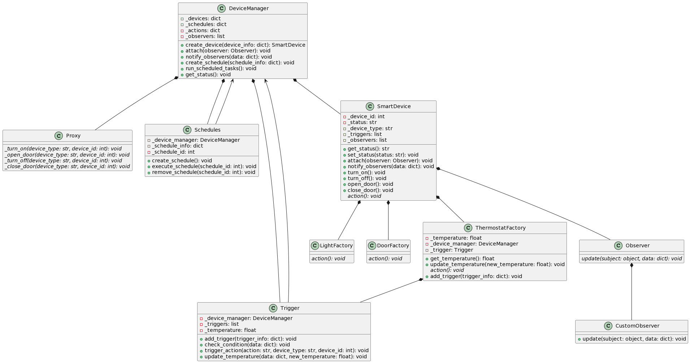
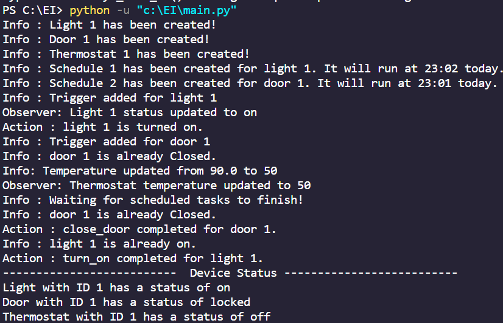

# Smart Device Management System

This is a Python project for managing smart devices and schedules using the Observer and Proxy design patterns.

## Table of Contents

- [Features](#features)
- [Getting Started](#getting-started)
  - [Prerequisites](#prerequisites)
  - [Installation](#installation)
- [Usage](#usage)
- [UML Diagram](#uml-diagram)
- [Contributing](#contributing)
- [License](#license)

## Features

- Create and manage smart devices (lights, doors, thermostats).
- Schedule tasks for devices to perform actions at specific times.
- Define triggers based on conditions (e.g., temperature) to perform actions.
- Implement an Observer pattern for observing and updating device status.
- Use a Proxy pattern for handling device actions.

## Data Flow



### Prerequisites

* Python 3.x installed on your system.

### Getting Started

1. **Clone the Repository:**

```shell
git clone https://github.com/yourusername/smart-home-automation.git
cd smart-home-automation
pip install schedule
```
## Project Structure

- `main.py`: This is the main entry point of your project, where you can run and interact with the smart device management system.

- `device_managers.py`: Contains the `DeviceManager` class, which handles the creation and management of smart devices, schedules, and actions.

- `scheduler.py`: Contains the `Schedules` class, responsible for scheduling tasks to be executed at specific times.

- `trigger.py`: Contains the `Trigger` class, which manages triggers based on specified conditions.

- `smart_devices.py`: Includes classes like `SmartDevice`, `LightFactory`, `DoorFactory`, and `ThermostatFactory` representing different types of smart devices.

- `observer.py`: Contains the `Observer` class and any custom observer classes like `CustomObserver` for observing and updating device status.

- `customize_exceptions.py`: Houses any custom exception classes used in the project, such as `MyException`.

## Usage

* Run the Application:
    * Shell
        ```python
        python main.py
        
## Output 


